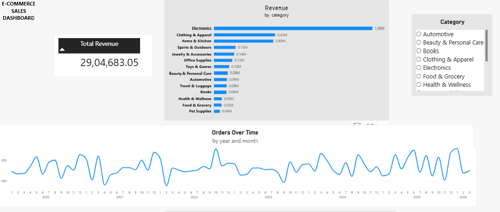
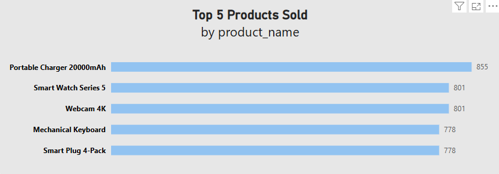

# 🛒 E-Commerce Sales Analysis

## 📌 Project Overview
This project analyzes e-commerce sales data to uncover insights on revenue, product performance, and sales trends over time.  
The goal is to identify key business patterns and support data-driven decision-making.

## 📊 Dashboards

### 📈 Dashboard 1 – Sales Overview

### 📊 Dashboard 2 – Top Products Analysis

## 🔍 Key Insights
- Electronics is the top-performing category, generating the highest revenue.
- Clothing & Apparel and Home & Kitchen are the next major contributors to sales.
- Sales show fluctuations over time but follow an overall upward trend.
- A small group of products (Top 5) contributes significantly to total sales.
- Seasonal spikes suggest high-demand periods during certain months.

## 💡 Business Recommendations
- Focus marketing and promotions on high-performing categories like Electronics.
- Bundle or promote top-selling products to maximize revenue.
- Plan inventory based on seasonal demand trends.
- Explore growth opportunities in mid-performing categories.

## 🛠️ Tools & Technologies
- SQL (Data querying & aggregation)
- Power BI (Dashboard & visualization)
- Excel (Data cleaning & preparation)

## 📂 Dataset
- E-Commerce dataset
